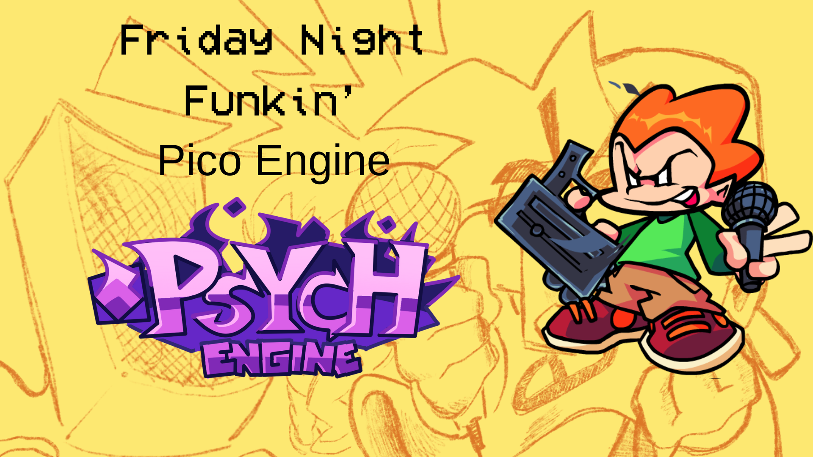
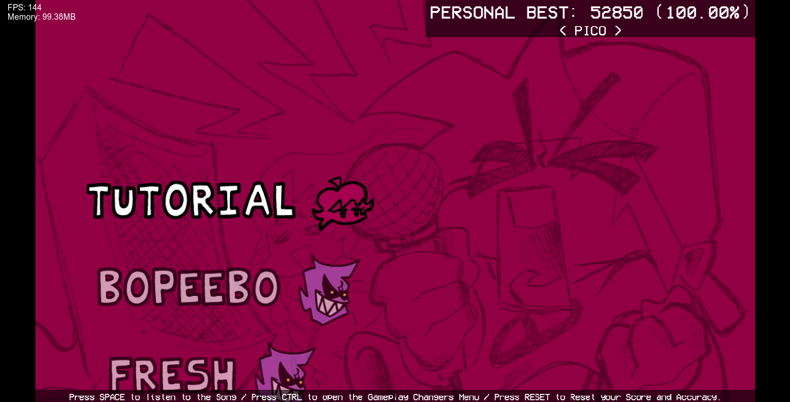
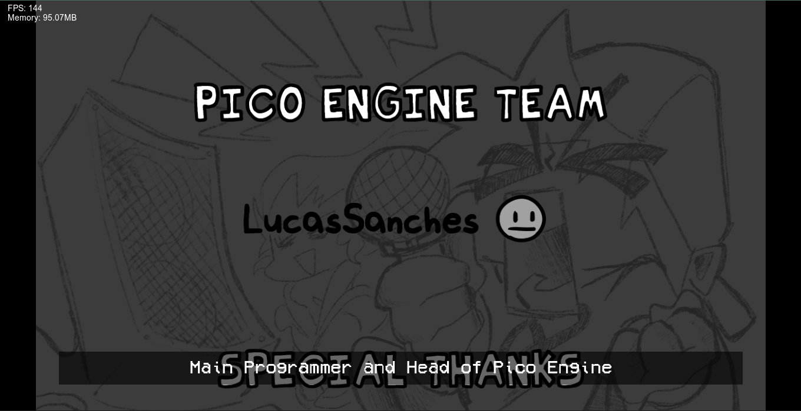
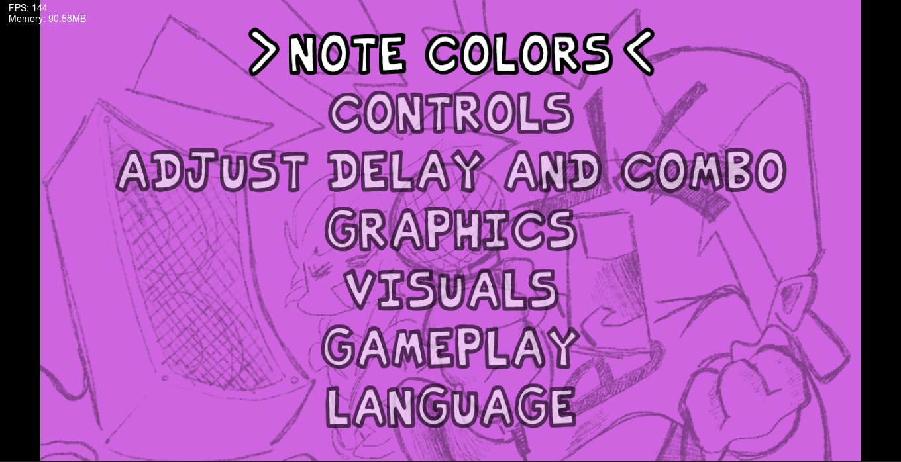

# FNF PicoEngine

- [Mod also on Gamejolt](https://gamejolt.com/games/Pico-Engine/948902)

# About
This project is a specialized fork of Psych Engine 1.0.4, meticulously redesigned to elevate the Pico Playable experience. Inspired by the official Friday Night Funkin’ Pico update, this engine serves as a bridge between the classic Psych Engine flexibility and modern, character-specific gameplay mechanics.

# Key Technical Enhancements
- While preserving the rock-solid architecture of Psych Engine, this version introduces:
- Refined Pico Integration: Custom animation handling and internal tweaks specifically calibrated for Pico's gameplay style.
- Enhanced Compatibility: Full support for existing songs, charts, and events, ensuring that modders can transition their projects seamlessly.
- Optimized Gameplay Logic: Adjustments to internal systems to provide a smoother, more "official-feeling" experience when playing as Pico.

# Our Mission
The primary objective of this project is to empower modders with a robust framework that simplifies the creation of Pico-centered content. We aim to deliver a high-performance environment that maintains the stability and feature-rich nature of the original Psych Engine while providing the tools necessary for the next generation of Pico mods.

# Menus
MainMenu

- You can switch between Free Play and Credits, plus the Options Menu

Freeplay Menu

- Here you can choose the music for the base game with the Pico playable

Credits Menu

- Here you can see the mod credits

Options Menu

- Here you can see all the options available for you to use

# Customization
- There isn't a customization option available yet, but I'm working on it
